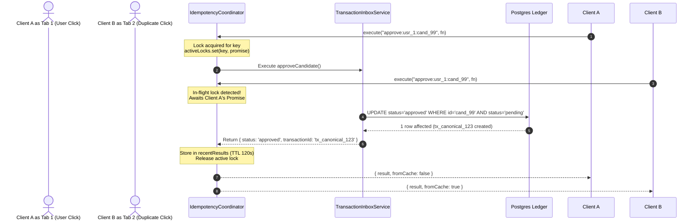

# Cashly Backend V11 — Concurrency Architecture & Race Condition Mitigation

## 1. Concurrency Threats in Financial Backends

Financial applications routinely encounter concurrent operations:
1. **Parallel Checkout Capture:** A browser extension detects a purchase event across two tabs or retries quickly on network latency, firing 2 identical capture payloads within 50ms.
2. **Double Approval Race:** A user double-clicks the "Approve & Post to Ledger" button, triggering simultaneous HTTP POST requests to `/api/transaction-inbox/candidates/:id/approve`.
3. **Concurrent Contribution & Goal Progress:** Multiple automated bank syncs or webhook events crediting a savings goal at the same millisecond.
4. **Stale Overwrite in Edits:** User updates transaction notes in one tab while auto-categorization worker finishes in background.

---

## 2. In-Flight Mutex Locking via `IdempotencyCoordinator`

Cashly V11 implements an in-flight Mutex lock mechanism in `backend/src/utils/idempotencyGuard.ts`:



### Key Concurrency Invariants:
1. **Never Double-Execute:** Even with 10 concurrent requests fired at $t = 0$, exactly **one** executes the database mutation.
2. **Safe Retry on Failure:** If the underlying database call throws a transient error (timeout, network glitch), the lock is released in a `finally` block so that a retry can execute cleanly without deadlock.
3. **Graceful Cache Resolution:** The other concurrent requests wait on the in-flight Promise and receive the completed result with `{ fromCache: true }`.

---

## 3. Optimistic Concurrency & Conditional Updates

At the database layer, all state transition queries use atomic conditional predicates:

```typescript
// Atomically claim pending candidate - prevents double-approval even across distributed nodes
const { data: updatedCandidate, error } = await supabase
    .from('transaction_candidates')
    .update({ status: 'approved', approved_at: new Date().toISOString() })
    .eq('id', candidateId)
    .eq('user_id', userId)
    .eq('status', 'pending') // <-- Concurrency condition!
    .select('*')
    .maybeSingle();

if (!updatedCandidate) {
    // Either already approved by another worker or not found
    throw createError('Transaction candidate already processed or unavailable', 409, 'CONFLICT');
}
```

---

## 4. Concurrency Verification
Validated via automated multi-worker stress test in `backend/src/utils/__tests__/concurrency.test.ts`:
- 10 parallel asynchronous promises fired simultaneously against a shared idempotency key.
- Verified: `executionCount === 1` and `fromCacheCount === 9`.
