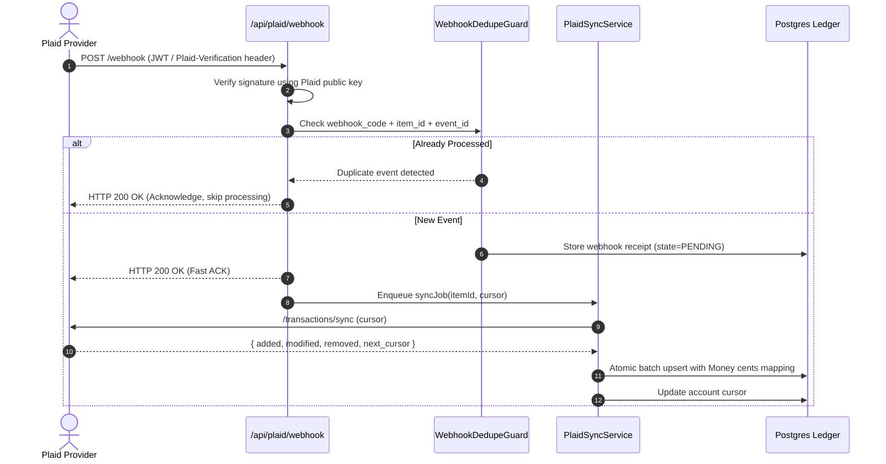

# Cashly Backend V11 — Bank Integration & Plaid Synchronization

## 1. Resilience Against Unreliable External Dependencies

External banking providers (Plaid, Yodlee, Open Banking) are intrinsically unreliable:
- Rate limits and transient 500/504 gateway timeouts.
- Out-of-order webhook delivery.
- Duplicate webhook delivery for identical events.
- Retroactive transaction adjustments (pending authorizations converting to settled transactions with modified amounts or merchant names).

---

## 2. Plaid Webhook Lifecycle

---

## 3. Transaction Reconciliation Rules

1. **Pending to Settled Mapping:** If Plaid sends a settled transaction with `pending_transaction_id`, Cashly updates the existing pending record rather than inserting a second transaction.
2. **Reversals & Refunds:** Matched against original transaction via `reference_number` or `provider_transaction_id`.
3. **Plaid Sync Invariant (`INV-10`):** External webhooks must be verified, deduplicated, and processed idempotently.
